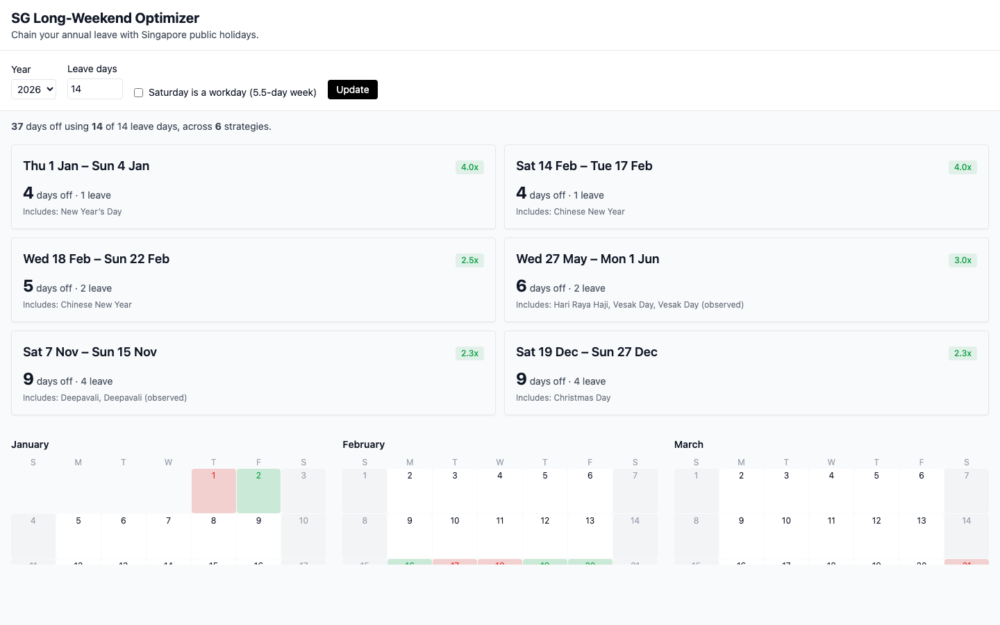

# SG Long-Weekend Optimizer

> Find the optimal way to use your annual leave with Singapore public holidays.

[Live demo →](https://sg-long-weekend-optimizer.vercel.app)



## What it does

Given your annual leave balance and a year, it returns a ranked list of leave-taking strategies that maximise your contiguous days off around Singapore's 11 public holidays. With the default 14 leave days, 2026 yields **37 days off across 5 strategies** — a 2.6× multiplier on every leave day used.

## How it works

For each pair of free days (weekends + public holidays) in the year, the optimizer treats the workdays in between as "leave to take" and scores the resulting range by `totalDaysOff / leaveDaysUsed`. The selection is the **exact optimum** of a weighted-interval scheduling problem with a leave-day budget, solved via O(n²) DP — runs in <5ms. Sunday public holidays get an observed-Monday entry synthesised at runtime (the data.gov.sg dataset doesn't pre-apply this). 0-leave "strategies" are excluded from the candidate pool — they're factual, not strategic, and would otherwise pre-empt better leave-using picks for the same range.

The full algorithm and the five hard problems I hit (including the discovery that my original greedy heuristic was only ~85% of optimum) are in [ARCHITECTURE.md](./ARCHITECTURE.md).

## Stack

- Astro 4 + TypeScript (static-first, ~no JS shipped)
- Tailwind CSS
- `dayjs` for date math (UTC-only to dodge timezone bugs)
- Vitest for tests
- Vercel for hosting
- Public holidays from [data.gov.sg](https://data.gov.sg) (dataset `d_8ef23381f9417e4d4254ee8b4dcdb176`, 2020–2026)

## Run locally

```bash
npm install
npm run dev          # http://localhost:4321
npm run test         # vitest, 6 tests
npm run build        # static output to dist/
npm run fetch:holidays   # refresh src/data/holidays-sg.json
```

## Architecture deep-dive

See [ARCHITECTURE.md](./ARCHITECTURE.md) for the engineering decisions, the five hard problems (PH observance, filter tuning, irregular CSS Grid months, timezone-safe date math, and a memorable mobile bug that wasn't a mobile bug), and the trade-offs.

## Attribution

Public holiday data from [data.gov.sg](https://data.gov.sg), used under the Singapore Open Data Licence. **Not affiliated with the Government of Singapore.**

## License

[MIT](./LICENSE)
